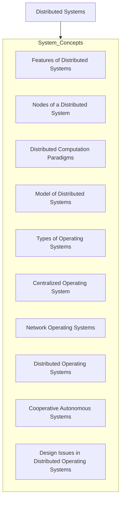
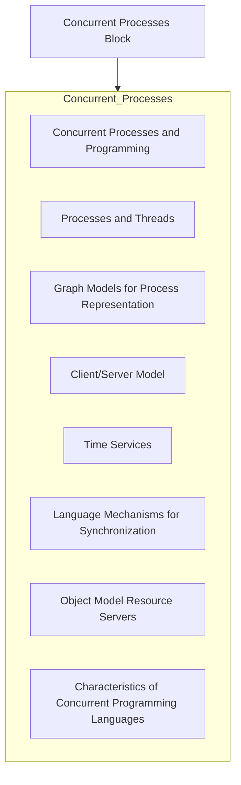
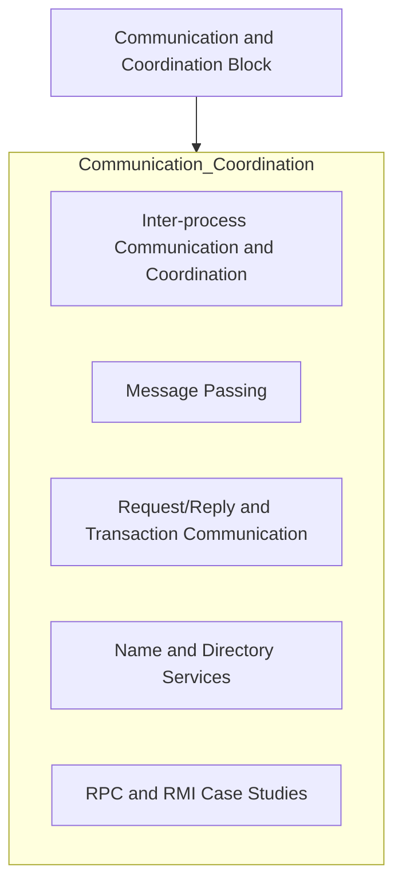
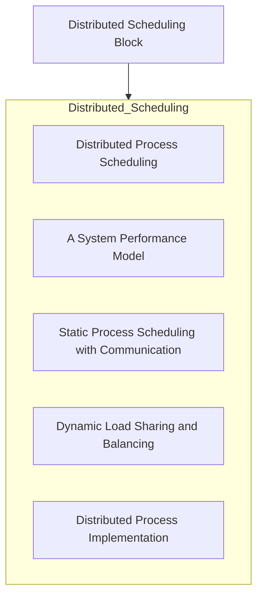
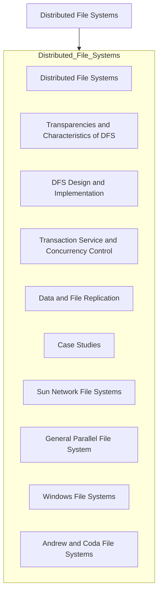
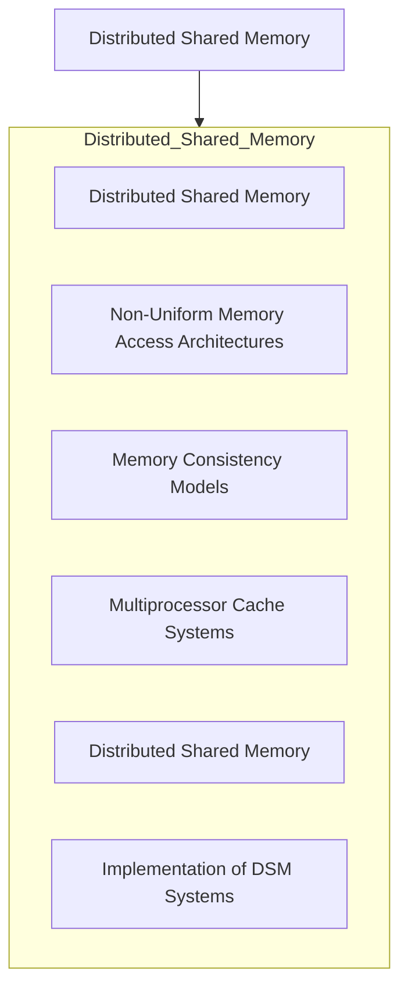
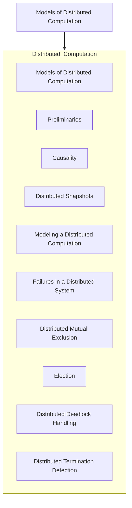
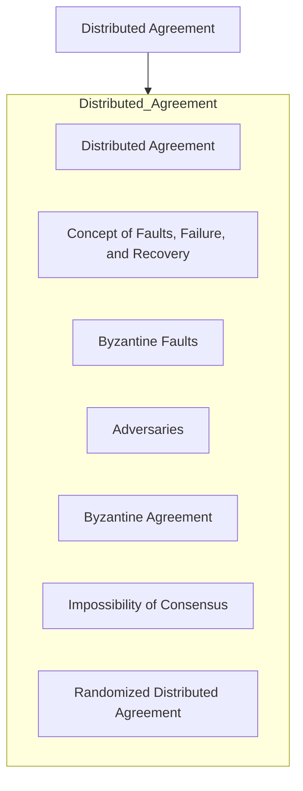
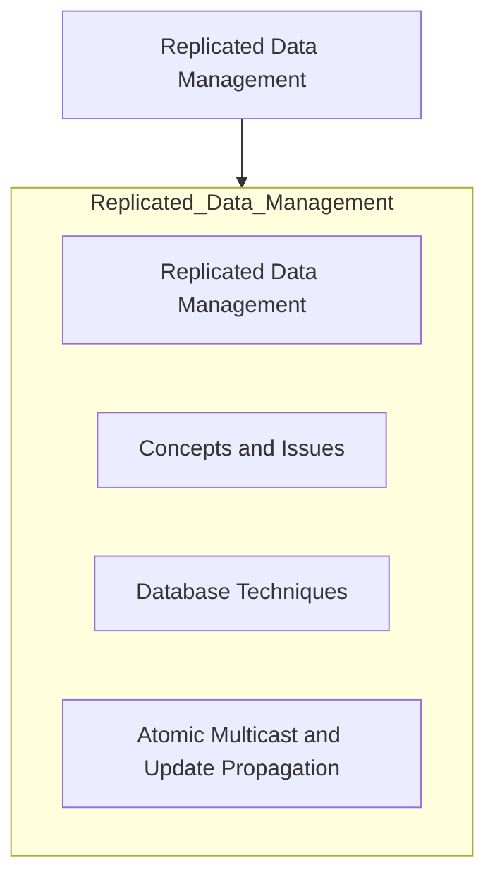
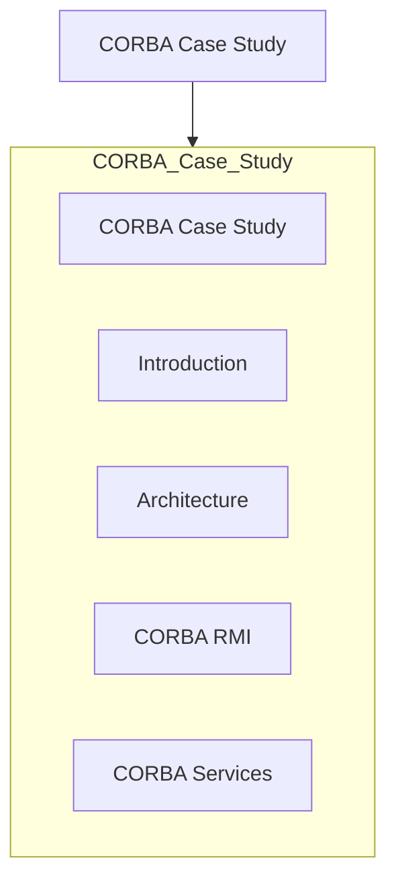

```mermaid
graph TD
  A[Theoretical Issues Block]
    A7[Systems Concepts and Architectures]
    A7_1[Goals]
    A7_2[Transparency]
    A7_3[Services]
    A7_4[Architecture Models]
    A7_5[Distributed Computing Environment]
    
    A8[Theoretical Issues in Distributed Systems]
    A8_1[Notions of Time and State]
    A8_2[States and Events in a Distributed System]
    A8_3[Time, Clocks, and Event Precedence]
    A8_4[Recording the State of Distributed Systems]
  end

  %% Main Hierarchical Connections
  A --> Theoretical_Issues
```


















